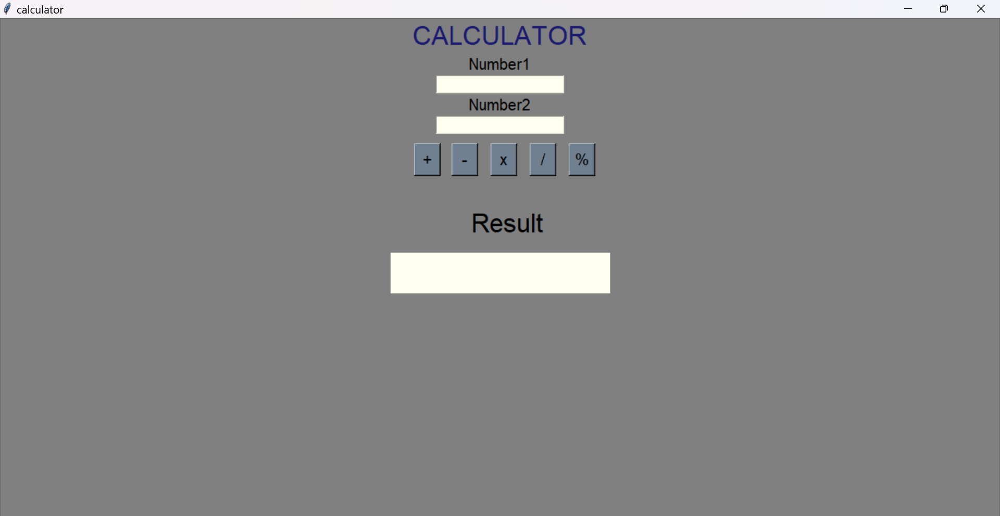

# Calculator
A basic Calculator Application for the desktop using Python

## Getting Started

**Prerequisites**

1. Python 3.8 and above
2. Tkinter

### Installation

**1** *Download the latest version of python from* [here](https://www.python.org/downloads/) 
**2** *Try install Tkinter by giving this command in cmd*
>pip install tkinter

### Know More
*Know about the Tkinter package* [here](https://docs.python.org/3/library/tkinter.html) 

### Preview

